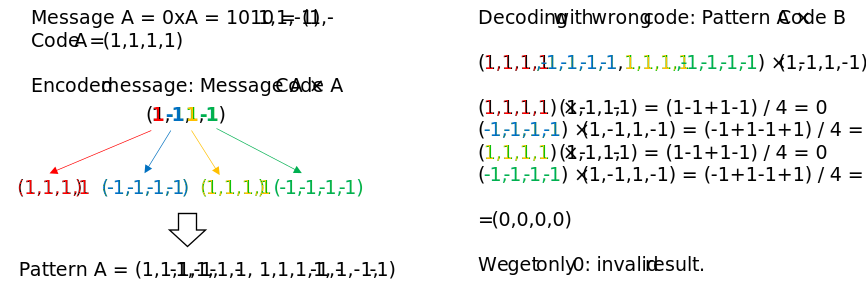

======================================
Spread Spectrum
======================================

Basics
======================================

Spread-spectrum is a modulation/encoding technique used to make signals more resilient to noise and/or interference. 
There are multiple types of spread-spectrum techniques, to name only the main ones:

- DSSS (Direct-Sequence Spread Spectrum): used for example by 3G (cellular), GPS
- FHSS (Frequency-Hopping Spread Spectrum): used for example by Bluetooth

In this article, we focus only on DSSS. The concept is fairly simple: we multiply a baseband signal (bits) by a another 
spreading signal (spreading code, chips). The spreading signal is a specific code that has a much higher rate than the 
baseband signal: the chiprate is much higher than the bitrate. This has the effect of spreading the spectrum of the baseband 
signal, making it look more like noise. 

.. _dsss-spreading-diagram:
.. figure:: spreading_diagram.svg
    :align: center
    :scale: 100%

    Spreading a signal

The spread signal still contains the same amount of energy as the original signal. Therefore since the bandwidth has become much wider 
after spreading, the PSD (Power Spectral Density) on the other hand becomes much lower. We define the **Spreading Factor** as

.. math::

    SF = \frac{Chiprate}{Bitrate}

At reception the de-spreading process allows recovery of the original baseband signal. We perform the reverse operation,
by cross-correlating our spread signal with the (known) spreading code. An interesting thing about this process is that if the 
received signal was contaminated by an interferer (uncorrelated to our wanted signal), the de-spreading process will naturally 
spread the interferer. The spread interferer will look like noise, easy to filter out; while the wanted signal will have 
recovered its "narrowband"/high PSD form. After de-spreading the SNR is increased by roughly the Spreading Factor which is why 
this technique **allows us to recover signals that are seemingly below the noise floor**.

.. _dsss-despreading-diagram:

    de-spreading with interference

CDMA
======================================

If we extend a little bit this concept, we can perform **CDMA**, or Code Division Multiple Access. CDMA is a technique used 
by 3G (CDMA2000, UMTS). It leverage DSSS in order to allow multiple users to **transmit at the same time on the same frequency**.

This is done by using spreading codes that are **orthogonal** to each other, that is if we consider each code to be a vector, 
their **dot product is zero**. Expressed in another way, their **cross-correlation is zero**. 

Let's say we have a message A spread with a code A. At reception, if we correlate this spread signal with code A we will get our message
back. However, if we correlate it with another code B orthogonal to code A, the output should be zero. Now if we have multiple users
each using their own code (orthogonal to the others), we should be able to transmit all of them simultaneously on the same
frequency, and still recover the messages. Of course there are limits as in reality the codes are not perfect and the more 
users we add, the more the SNR degrades.

A famous example of orthogonal code families are the **Hadamard Matrix** [1]_. A Hadamard matrix is a square matrix
containing values +1 or -1, and all rows of the matrix are orthogonal to each other. For example the 4th order Hadamard matrix is

.. math::

    H_4 =   \begin{bmatrix}
            1& 1& 1& 1 \\
            1& -1& 1& -1 \\
            1& 1& -1& -1 \\
            1& -1& -1& 1 
            \end{bmatrix}

Consider the two first rows (1,1,1,1) and (1,-1,1,-1): their dot product is (1x1) + (1x-1) + (1x1) + (1x-1) = 0, i.e the two
vectors are orthogonal. Let's use that in an example to explain how it works: We use the 1st code to encode a message, 
and try to decode with the 2nd (orthogonal) code:

.. _dsss-hadamard:

    Example of using a hadamard code

Let's go further: we now use the 2nd code to encode a 2nd message, and we add it to the 1st message as if we were transmitting
them on the same channel:

.. _dsss-hadamard2:
.. figure:: hadamard_example2.svg
    :align: center
    :scale: 100%

    Encoding two messages to transmit on the same channel

The composite pattern C contains both (encoded) messages A and B. If we try to decode it using code A, we find message A:

.. _dsss-hadamard3:
.. figure:: hadamard_example3.svg
    :align: center
    :scale: 100%

    Decoding message A from the composite pattern

By applying a similar process with code B, the reader will realise that we end up decoding message B.

Python example
======================================

.. admonition:: The full python code for this example is available
   :class: pythonCode

   :download:`download here <../Scripts/iq-imbalance.py>`

   Validated with: Python 3.6.7 - Numpy 1.19.4 - Scipy 1.5.4 - Matplotlib 3.3.3

Messages
------------

We want to transmit two messages:

.. code-block:: python

    Message A: [0,1,0,0,1,0,0,0,0,1,0,0,0,1,0,1,0,1,0,0,1,1,0,0,0,1,0,0,1,1,0,0,0,1,0,0,1,1,1,1]
    Message B: [Hidden]

.. Note::

    Any binary stream is represented and processed in NRZ format (1 -> 1 and 0 -> -1) in the script.

For simplicity we assume the bitrate to be 1bps. We would like to transmit these two messages on the **same channel**.
Problem: if we do that, they would interfere with each other. If we spread each message with the right code, we should be 
able to transmit both of them on the same channel without any issue. 

Choosing the right spreading codes
-----------------------------------

The Hadamard codes we presented earlier are good but not ideal. Ideally our spreading codes should have two properties:

- Noise-like autocorrelation
    The bits in the spreading sequence should be as uncorrelated as possible, and the autocorrelation peak must be very narrow
    and very strong. This has two advantages: a high/narrow peak will allow easy detection of the pattern on the receiver side
    even if the signal is strongly distorted; and it will also help to combat multipath effects as delayed replicas can easily be 
    detected.

- Weak cross-correlation with other codes (ideally: orthogonality)
    If the different codes are not uncorrelated, there will always be residual interference at the receiver. That interference will be
    proportional to the amount of cross-correlation between codes, and will limit the ability of receiver to correctly decode
    messages.

Noise-like sequences are called **PN (Pseudo-Noise)** sequences [2]_. Following the universal principle of "there is no such thing
as a free lunch", the two properties mentionned above are not fully compatible: designing a code is a tradeoff between the two.

A specific type of PN sequences called the **Gold sequences** [3]_ offer very good tradeoff between the autocorrelation and 
cross-correlation properties. Gold sequences, named after Robert Gold, are generated by modulo-2 sum of two PN sequences 
(more specifically m-sequences). They are used for example in the GPS system.

In our example we use two Gold sequences of length 31:

.. code-block:: python

    codeA = [1,1,1,1,1,-1,-1,-1,1,1,-1,1,1,1,-1,1,-1,1,-1,-1,-1,-1,1,-1,-1,1,-1,1,1,-1,-1]
    codeB = [1,1,1,1,1,-1,-1,1,-1,-1,1,1,-1,-1,-1,-1,1,-1,1,1,-1,1,-1,1,-1,1,-1,1,1,1,-1]

.. _dsss-gold-sequence:
.. figure:: gold_correlationProperties.svg
    :align: center
    :scale: 100%

    Gold sequences correlation properties (upsampled by a factor of 4)

Both our codes our fairly noise-like: They have a very strong autocorrelation peak at the time of 0 lag, and that peak is very
sharp: it's only one sample. Everywhere else the autocorrelation is very low. Also, the cross-correlation of the two codes
is good: it's low everywhere. Still, it's not zero, so there will be a residual interference pattern at the receiver.

Spreading the message
----------------------

Using the two Gold codes shown above, we spread our messages A and B:

.. _dsss-spreadMessageA:

    Message A spreading with Code A

As the encoded pattern has a much higher "raw" bitrate than the original message, the spectrum is inevitably spread:

.. _dsss-spectrumMessageA:
.. figure:: messageA_spectrum.svg
    :align: center
    :scale: 100%

    Message A spectrum before and after spreading

Once we have encoded message B with code B, we can add messages A and B together to form a composite message C:

.. _dsss-messageC:

    Composite pattern

This signal containing information from both messages A and B will be transmitted through a single communication channel.

De-spreading
-----------------

At the receiver side, we receive the composite message. In order to recover the original messages A and B, we can use 
correlation. By correlating the composite pattern with code A for example, we **should** be able to recover message A.
Indeed, since code B is orthogonal to code A; and since message B was encoded with code B, then correlating code A with
the information from message B (inherently contained in the composite pattern) **should** yield only noise.

On the other hand, correlating code A with the information from message A should lead to energy maximums following the encoded bits
We try this with our python script and we get:

.. _dsss-messageA_decoded:

We can clearly identify positive and negative peaks that stand out from the noise. If we assign a '1' to a positive peak
and a '0' to a negative peak, we find:

.. code-block:: python

    decoded message: [0,1,0,0,1,0,0,0,0,1,0,0,0,1,0,1,0,1,0,0,1,1,0,0,0,1,0,0,1,1,0,0,0,1,0,0,1,1,1,1]

Which is indeed, our message A. Similar process can be applied to decode message B.

Limitations
--------------

Spread-spectrum sounds great since we can transmit multiple messages at the same time using the same channel.
What would prevent us from combining as many messages as possible, in order to maximize spectrum utilisation?

For one, spreading codes are unfortunately not perfect: they are not perfectly noise-like, and families of codes 
that could be used do not have perfect cross-correlation properties. 
Therefore the more we add different messages, the more the overall SNR degrades and it becomes harder and harder
to recover each message. 

Additionally, spread-spectrum, by its nature, uses more bandwidth. And bandwidth is very expensive. Nowadays, 
technologies such as WIFI, 4G, 5G use OFDM (Orthogonal Frequency Division Multiplexing) waveforms which are basically
a tightly packed collection of narrowband signals.
 
References
==============================

.. [1] https://en.wikipedia.org/wiki/Hadamard_matrix

.. [2] https://skynet.ee.ic.ac.uk/notes/CS_2016_7A_PN_codes_PN_signals_and_SSComms.pdf

.. [3] R.Gold, Optimal binary sequences for spread spectrum multiplexing, IEEE Transactions on Information Theory, Vol.13 Issue 4, p619-621, 1967