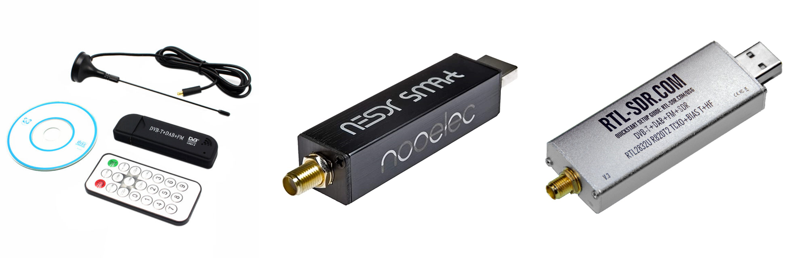
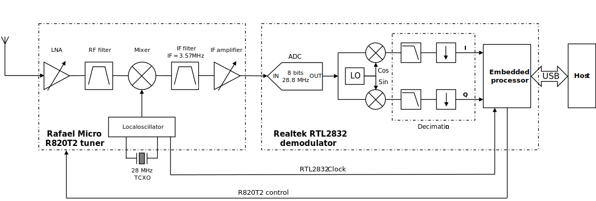

===========================
RTL-SDR introduction
===========================

Quick history
===========================

The 'discovery' of the RTL-SDR was a major revolution in the world of Radio.
Before then, SDRs were really expensive gear and mostly confined to engineering or research labs.
Then in the early 2010's, some clever people found (more information `here <https://www.rtl-sdr.com/about-rtl-sdr/#:~:text=The%20origins%20of%20RTL%2DSDR,based%20on%20the%20RTL2832U%20chipset.&text=Over%20the%20years%20since%20its,can%20access%20the%20radio%20spectrum.>`__)
that we could take cheap DVB-T (Digital Video Brodcast) receiver dongles and access the
raw IQ samples stream from the baseband chip directly. 

These dongles cost around 10$, making them available to anyone. The first ones to be used were the DVB-T dongles massively 
available on online selling platforms. They did have some issues: cheap crystal (i.e. poor frequency stability),
thermal issues, dodgy connectors, etc. so some companies decided to redesign the dongles to make them more
robust with a TCXO instead of a crystal, metal enclosures, Low noise regulators, etc. 
These ruggedized versions are more expensive (around 20-30$), 
but for what we can achieve with that, it's still incredibly cheap. 

Over the years other types of affordable SDRs were made
and we now have plenty of choices from 10$ to several thousands with everything in between. Here are some examples of RTL-SDR dongles:    

.. _sdrTypes:

    Left: standard DVB-T - Center: Nooelec ruggedized RTL-SDR - Right: RTL-SDR.com ruggedized RTL-SDR

The driver that allows us the use the SDR dongles is the librtlsdr driver developed by Osmocom 
(see link at the bottom).

Architecture and characteristics
==================================

The fundamental architecture for most dongles is based on the R820T RFIC from Rafael Micro (`Datasheet <https://rtl-sdr.com/wp-content/uploads/2013/04/R820T_datasheet-Non_R-20111130_unlocked.pdf>`__)
and the RTL2832U baseband IC from Realtek (`website <https://www.realtek.com/en/products/communications-network-ics/item/rtl2832u>`__).
The picture below shows a very simplified synoptic of the way the RTL-SDR operates.

.. _SDRarchitecture:

    RTL-SDR architecture

The R820T tuner has a classic single-ended superheterodyne architecture.
The input LNA can be set to fixed or auto gain mode, and the gain in fixed mode can be set from 0 to 50dB.
That 50 dB range actually includes the mixer gain that cannot be set independently. The output of the mixer then 
goes into a 3.57MHz IF filter, before being fed to an IF amplifier (VGA). Like the LNA, the VGA can be set
into fixed or auto gain mode, although the gain in fixed mode cannot be changed. It appears however with the 
latest versions of librtlsdr that it is now possible to set the mixer gain separately from the LNA.
It is also possible to set the gain value when the VGA is in 
fixed gain mode, allowing for a total combined gain range of 100dB for LNA + Mixer + VGA.

Once the IF signal gets out of the tuner, it's sampled by the RTL2832's ADC with a sampling frequency
of 28.8 MHz. The ADC has a resolution of 8 bits, but an ENOB of ~7 bits, however this resolution can be improved through oversampling and decimation. The sampled
signal is converted to IQ format and translated to baseband, then the I and Q branches are decimated and the resulting
samples are made available through a USB bus. The final sampling rate can be chosen from 225 kHz to 
3.2 MHz; although the stream is known to be unstable (samples will be dropped) above 2.56 MHz.

Some dongles also provide a direct access at the RTL2832's ADC input, allowing for direct sampling.
The RTL2832 can then sample the low-end of the spectrum (HF bands), where lots of Hams operate.

In summary:

+------------------------------+---------------------------------------------------+
| Frequency tuning range       | 24 - 1766 MHz                                     |
|                              +---------------------------------------------------+
|                              | Down to ~DC for direct sampling capable devices   |
+------------------------+-----+---------------------------------------------------+
| Gain range (LNA + Mixer)     | 0 - 50 dB                                         |
+------------------------+-----+---------------------------------------------------+
| R820T IF frequency           | 3.57 MHz                                          |
+------------------------+-----+---------------------------------------------------+
| RTL2832 Sampling Rate        | 225.001 to 300 kHz                                |
|                              +---------------------------------------------------+
|                              | 900.001 to 3200.000 kHz                           |
+------------------------+-----+---------------------------------------------------+
| RTL2832 ADC resolution       | 8 bits (~7bits ENOB)                              |
+------------------------+-----+---------------------------------------------------+
| Current consumption          | About 300mA when sampling                         |
+------------------------+-----+---------------------------------------------------+

Useful links
==================================

+------------------------------+-----------------------------------------+
| RTL SDR blog                 | https://www.rtl-sdr.com/                |
+------------------------+-----+-----------------------------------------+
| Osmocom project (librtlsdr)  | https://osmocom.org/projects/rtl-sdr/   |
+------------------------+-----+-----------------------------------------+
| RTL information goldmine     | http://superkuh.com/rtlsdr.html         |
+------------------------+-----+-----------------------------------------+
| librtlsdr python wrapper     | https://pypi.org/project/pyrtlsdr/      |
+------------------------+-----+-----------------------------------------+
| GNU Radio                    | https://www.gnuradio.org/               |
+------------------------+-----+-----------------------------------------+

.. |br| raw:: html

    